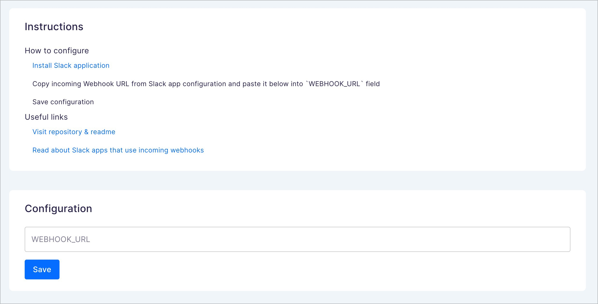

# How to setup your Slack application

## Install Saleor App Slack

Use [readme](./../README.md) to get started

## Create new Slack application

Go to Slack API [page](https://api.slack.com/apps?new_app=1) and select create app from scratch:

Save your app name as `Saleor` and choose your [workspace](https://slack.com/help/articles/206845317-Create-a-Slack-workspace) then click `Create App`

On the next screen select `Incoming Webhooks` feature

Activate `Incoming Webhooks`

You should see new section just under `Activate Incoming Webhooks` - click `Add New Webhook to Workspace`

You will get redirected to new page where you can select channel that will receive Saleor messages. Select one and click `Allow`

You should return to previous `Incoming Webhooks` page with success message - scroll down to `Webhook URLs for Your Workspace` where you can find new section with `Webhook URL`. Click `Copy` button to copy URL to your clipboard.

Take this copied URL and paste it inside Saleor App configuration in Saleor Dashboard

Right now you can create an order e.g using Saleor Dashboard to see message in your selected Slack channel

## Useful links

- [Block Kit Builder](https://app.slack.com/block-kit-builder). Visual tool that helps with building & previewing Slack messages.
